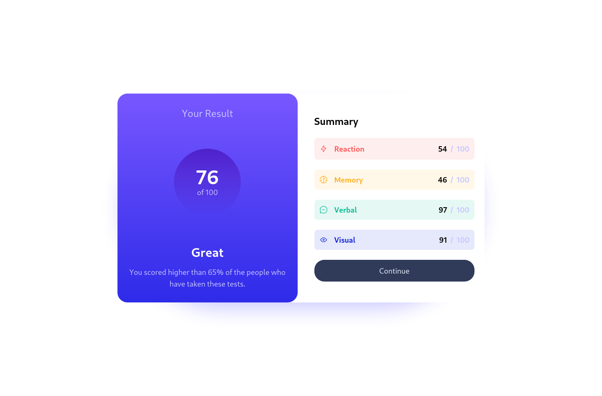

# Solución de Frontend Mentor - Results summary component

En este proyecto, desarrollé el componente "Results summary component" de Frontend Mentor usando TailwindCSS para practicar el uso de esta biblioteca.

## Mi proceso

### Tecnologías

- Html
- Css
  - Flexbox
- Mobile First
- tailwindcss

### ¿Que aprendí?

#### Mobile First

En este proyecto pude practicar sobre el flujo de trabajo "Mobile First" trabajando primero para pantallas pequeñas y enfocandome en su diseño

#### Tailwind CSS

Tambien aprendi sobre Tailwind CSS, y como configurar su entorno de desarrollo

### Continuar aprendiendo

Tengo que seguir aprendiendo sobre "*Responsive Design*" y "*Tailwind CSS*"

## Indice

- [Solución de Frontend Mentor - Results summary component](#solución-de-frontend-mentor---results-summary-component)
  - [Mi proceso](#mi-proceso)
    - [Tecnologías](#tecnologías)
    - [¿Que aprendí?](#que-aprendí)
      - [Mobile First](#mobile-first)
      - [Tailwind CSS](#tailwind-css)
    - [Continuar aprendiendo](#continuar-aprendiendo)
  - [Indice](#indice)
  - [Resumen](#resumen)
    - [El desafio](#el-desafio)
    - [Screenshots](#screenshots)
      - [Movil](#movil)
      - [Desktop](#desktop)
    - [Recursos Utiles](#recursos-utiles)

## Resumen

Este componente fue creado como una práctica para aprender a usar Tailwind CSS.

### El desafio

Los usuarios deberían poder:

- Ver el diseño óptimo para la interfaz según el tamaño de pantalla de su dispositivo
- Ver estados de desplazamiento y enfoque para todos los elementos interactivos en la página

### Screenshots

#### Movil

374px

#### Desktop

1440px

### Recursos Utiles

- [tailwindcss](https://tailwindcss.com/) - Documentación oficial de Tailwindcss.
- [flexbox](https://css-tricks.com/snippets/css/a-guide-to-flexbox/) - Este artículo me ayudó mucho a comprender mejor flexbox, muy útil para los que le cuesta Flexbox como a mí.
